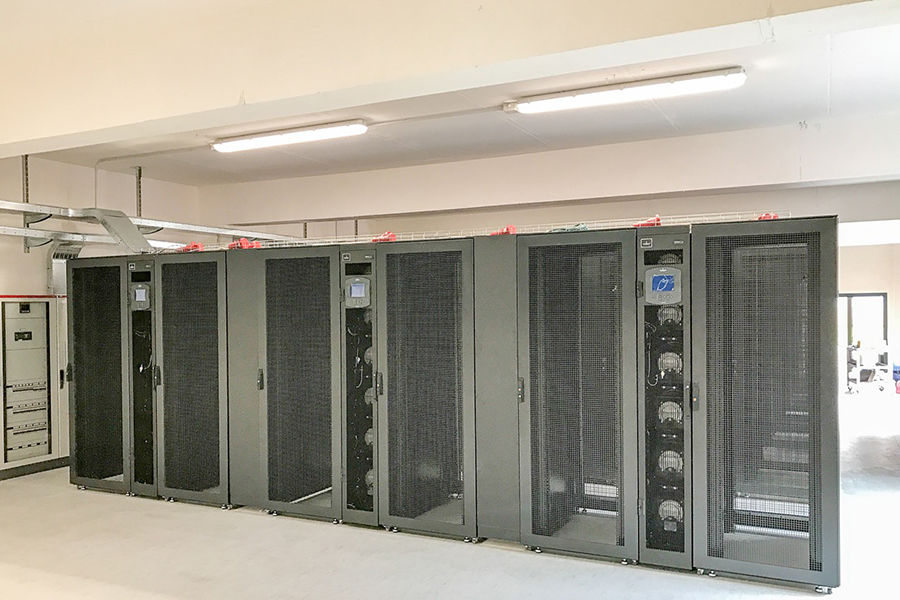

About Unipi HPC
===================

The Unipi HPC Datacenter (**UnipiHPC**) is ...

..    :alt: Alternative text

San Piero a Grado (PI) in Via Livornese 1291.

The Green HPC Data Center was built in an area owned by University of Pisa which is located inside the Parco di Migliarino, San rossore massaciuccoli (San Piero a Grado (PI) in Via livornese 1291).

.. image:: ./images/maps.png
    :width: 400
    :alt: San Piero a Grado (PI) in Via Livornese 1291

The building that houses it has been adapted to the new function, creating a unique space for the main engine room of about 250 square meters. The area is located about 8 km from the centre of Pisa and is reached by a fiber optic ring, also owned by the University, which guarantees a high level of connectivity and reliability. 

The construction time of the Centre was particularly tight, from February to October 2016, especially considering the particular location of the property, in an area with strong landscape constraints, and the total amount of the intervention, about 1.4 million euros.

.. toctree::
    :maxdepth: 2
    :numbered:
    :caption: Contents
    
    ./info/san-piero
    ./info/current_and_future
    ./../gallery/gallery

.. include:: /date/date.rst

