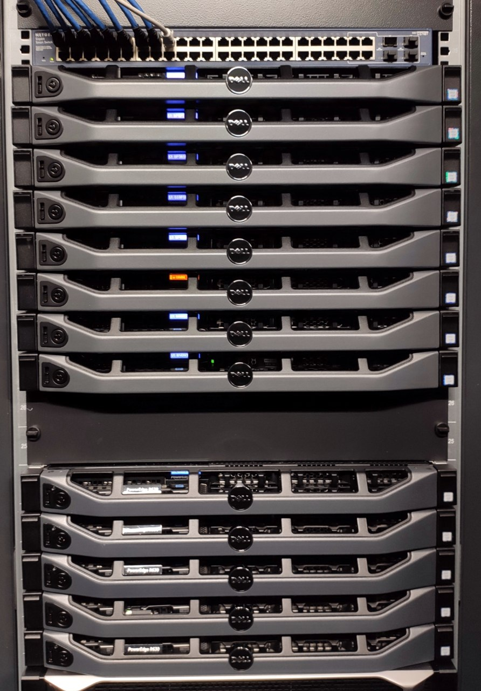
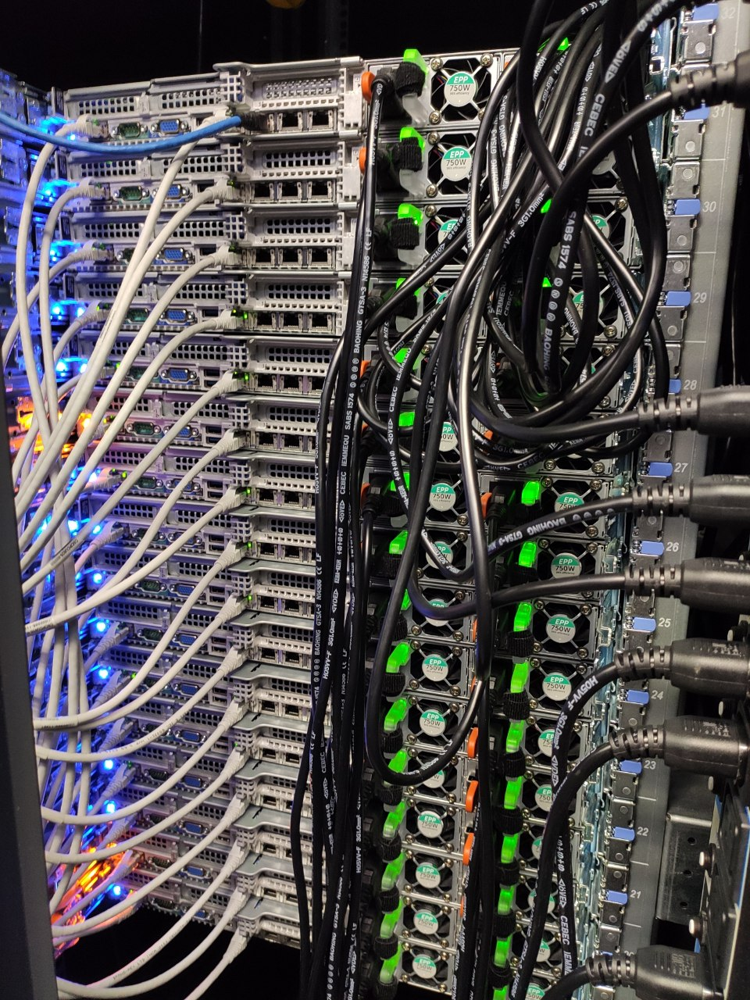
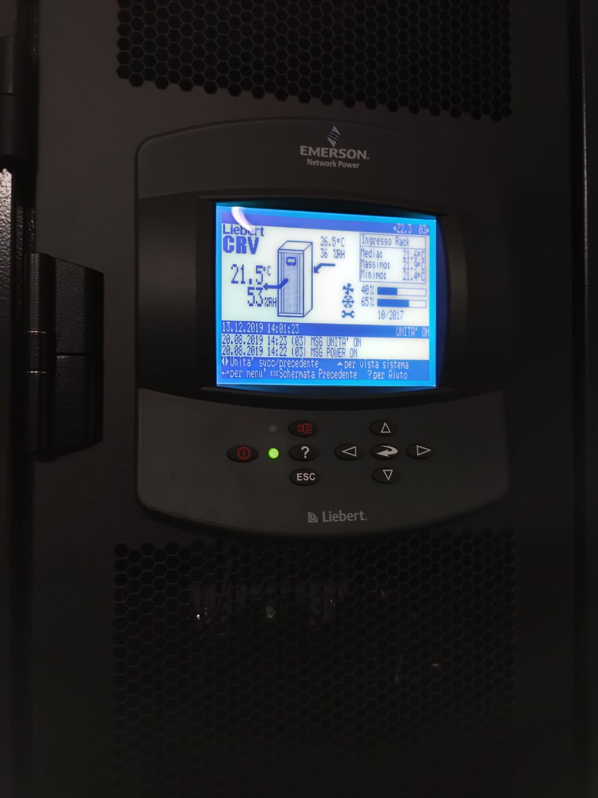

**********************************
List of available resources
**********************************

Hardware
###########

The Unipi HPC Datacenter offers more than 100 nodes, allowing to run more than 2000 parallel processes, and may advanced GPU.
More in details can be found in the following table.

.. csv-table:: List of Available Resorces @ Unipi Data center
   :file: hardware/resources.csv
   :header-rows: 1

.. TODO: fotine hw insieme

.. TODO: descrizione qualche cluster con fotine

..    :alt: San Piero a Grado (PI) in Via Livornese 1291

..    :alt: San Piero a Grado (PI) in Via Livornese 1291

..    :alt: San Piero a Grado (PI) in Via Livornese 1291

Example of cluster machine
''''''''''''''''''''''''''''''
Il cluster è fatto da head node 
TODO

Example of non-clustered machine
''''''''''''''''''''''''''''''
Il cluster è fatto da head node 
TODO

.. include:: /date/date.rst

