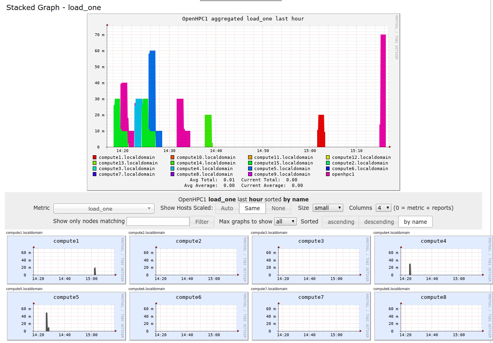
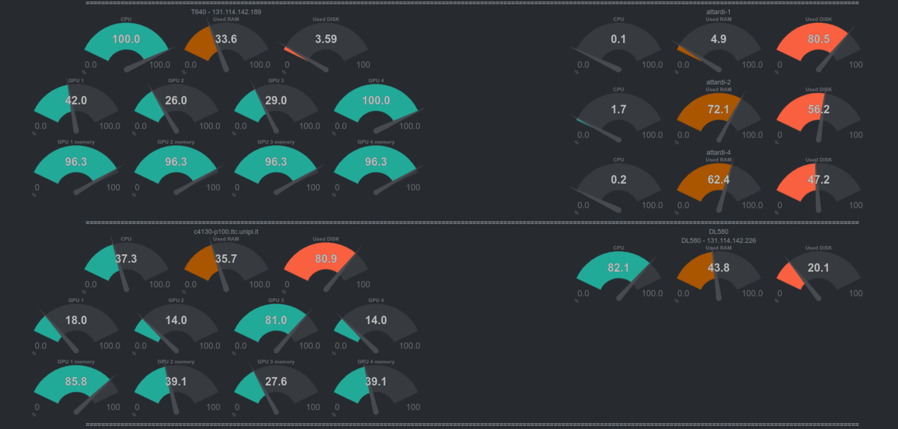
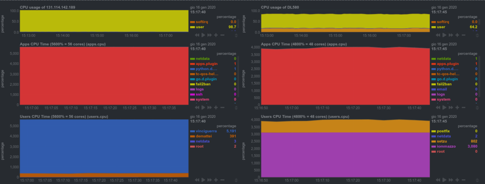

*************************************
Resources monitoring and accounting
*************************************

Monitoring is an important part of assuring resource availability and correct use.  

We monitor resource usage with realtime dashboards and alarms.

In particular we use `Ganglia <http://ganglia.sourceforge.net/>`_

.. image:: ./images/ganglia-monitoring.png
    :width: 400
    :alt: example of resource monitoring with Ganglia

and `NetData <https://www.netdata.cloud/>`_

next steps
""""""""""""""""""
We plan to realize usage data collection and data-warehouse.

The goal is the production of *usage reports* allowing to understand 
*who* uses *what* for *what purpose*, 
and to provide *resource accounting and billing*.

    .. include:: /date/date.rst
