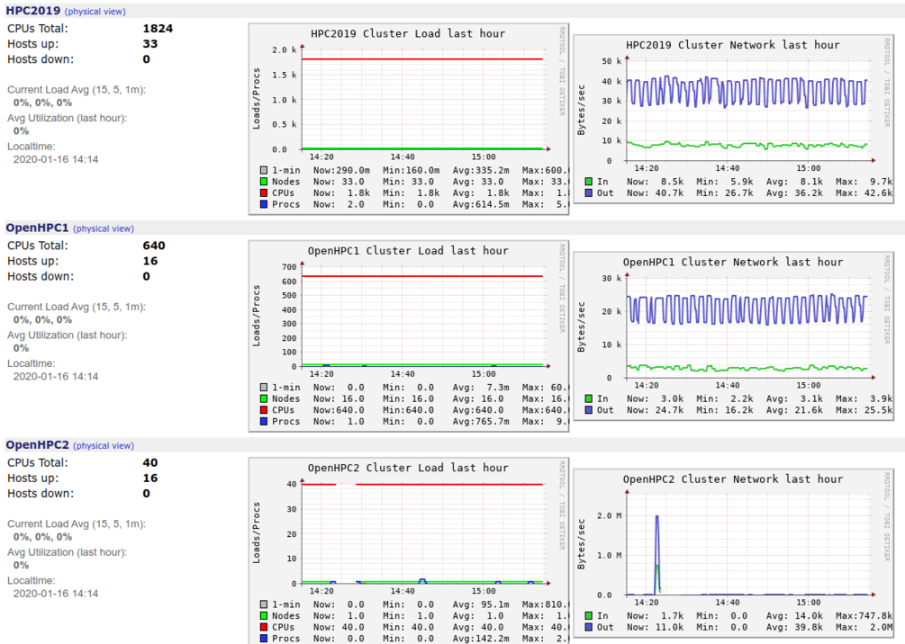

**********************************
Monitoring resources
**********************************

We monitor resource usage with dashboards and alarm; 
in particular we use `Ganglia <http://ganglia.sourceforge.net/>`_

and `NetData <https://www.netdata.cloud/>`_

.. image:: ./images/netdata-monitoring.png
    :width: 400
    :alt: example of resource monitoring with NetData

.. image:: ./images/netdata-monitoring2.png
    :width: 400
    :alt: example of resource monitoring with NetData

    .. include:: /date/date.rst
